# Lab 2: Working with HDFS

## Objective

The objective of this lab is to gain hands-on experience with the Hadoop Distributed File System (HDFS). We learned to start Hadoop services, create and manage users and directories in both Linux and HDFS, transfer files into HDFS, and explore HDFS contents via both the command line and the Web UI.

---

## 1. Starting HDFS and YARN Services

To begin the lab, we launched the required Hadoop daemons. This step was critical to initiate the core services that allow HDFS and YARN to function.

We opened a terminal and switched to the `hadoop` user using:

```bash
su - hadoop
```

Then, we navigated to the `sbin` directory and executed the following scripts:

```bash
cd ~/hadoop/sbin
./start-dfs.sh
./start-yarn.sh
```


This started the NameNode, DataNode (for HDFS), and the ResourceManager and NodeManager (for YARN). Successful output messages confirmed the services were up and running.

---

## 2. Exploring HDFS and Linux File Systems

Next, we logged in as student and explored the structure of HDFS and local Linux file systems. As the `student` user, we listed the root directory of HDFS:

```bash
hdfs dfs -ls /
```
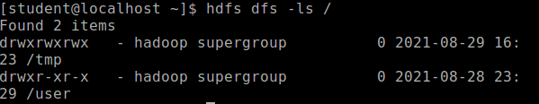

This displayed top-level directories such as `/tmp` and `/user`. We then checked for the presence of a home directory for the `student` user:

```bash
hdfs dfs -ls /user
hdfs dfs -ls /user/student
```
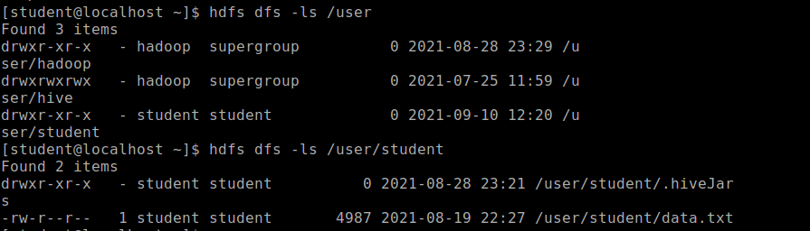

It was empty initially. In parallel, we examined the local Linux home directory:

```bash
cd /home/student
ls -l
```
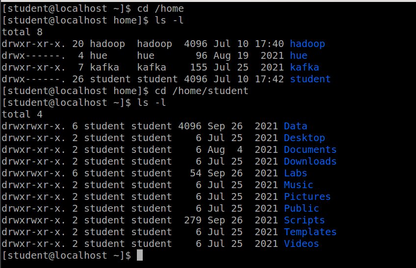

This step highlighted the dual file systems in use—HDFS and Linux.

---

## 3. Creating a New Linux and HDFS User

We then performed user administration tasks by creating a new Linux user (`student2`) and a corresponding HDFS home directory.

To add a new user with superuser privileges:

```bash
sudo useradd student2 -m
sudo passwd student2
sudo usermod -aG wheel student2
```

We tested the new user:

```bash
su - student2
cd
pwd
groups
```
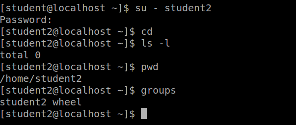

For HDFS, as `hadoop` user, we created and assigned ownership of a new directory:

```bash
hdfs dfs -mkdir /user/student2
hdfs dfs -chown student2 /user/student2
```

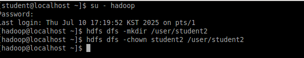

<!-- Verification from the `student2` account confirmed that the HDFS home directory was successfully created. -->
After switching to the student2 user account, we verified the creation of the user's HDFS home directory by running the following command in the terminal:
```bash
hdfs dfs -ls /user/student2
```

Although no files or subdirectories were listed (since /user/student2 was empty), the absence of an error message confirmed that the directory exists in HDFS. This verified that the home directory for the student2 user had been successfully created.

To further confirm the behavior of HDFS when a directory does not exist, we attempted to list the contents of a non-existent directory by running:
```bash
hdfs dfs -ls /user/student3
```

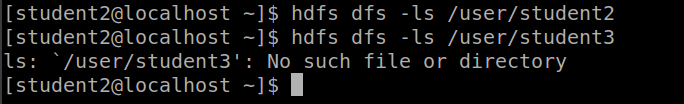

---

## 4. File Handling in HDFS

Returning to the `student` user, we created a subdirectory in HDFS for a MapReduce test:

```bash
hdfs dfs -mkdir MRtest
```
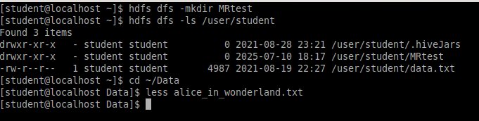

We navigated to the local file containing *Alice in Wonderland*:

```bash
cd ~/Data
less alice_in_wonderland.txt
```


Then, we uploaded this file into our HDFS MRtest directory:

```bash
hdfs dfs -put ~/Data/alice_in_wonderland.txt /user/student/MRtest/
```

To ensure the file was successfully transferred, we listed the contents:

```bash
hdfs dfs -ls /user/student/MRtest
```
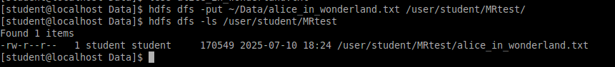

---

## 5. Exploring HDFS with the Web UI

To visually inspect HDFS, we opened the Firefox browser and visited:

```
http://localhost:9870
```

We examined the following sections:

* **Overview Tab:** Displayed summary of datanodes and disk capacity.
* **Datanodes:** Showed health and activity of nodes (only one in our case).
* **Snapshot:** Presented snapshot options for directories.
* **Startup Progress:** Detailed the loading of fsimage and edits file.

From the **Utilities > Browse the file system**, we navigated to `/user/student/MRtest` and opened `alice_in_wonderland.txt`. We viewed the **Block Information**, which included the Block ID and Block Pool ID.

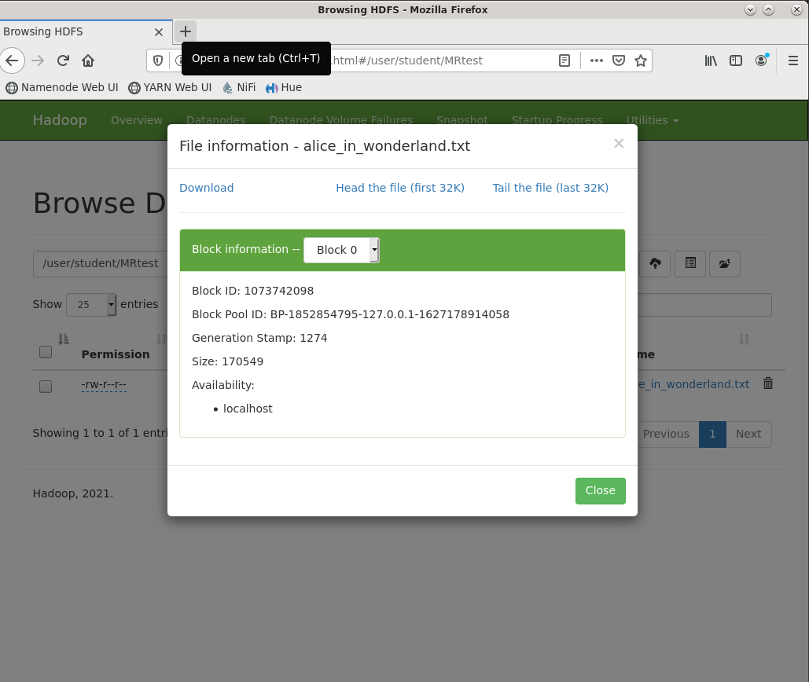

---

## 6. Locating Block Storage on Disk

We used the terminal to locate the actual block files on the disk using the `find` command.
First, as `hadoop` user, we searched for the Block Pool ID:

```bash
sudo find / -name <BlockPoolID> -print
```

After locating the directory, we searched for files related to our specific Block ID:

```bash
cd <path_found>
sudo find . -name *<BlockID>* -print
```
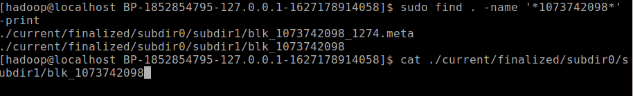

The block file and its metadata were discovered. We viewed the actual content of the text block using:

```bash
cat <block_file_path>
```
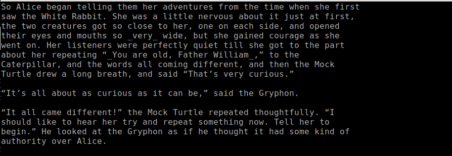

This confirmed that Hadoop had stored our text file successfully in its block-based architecture.

---

## Summary

In Lab 2, we:

* Started and validated HDFS and YARN services.
* Explored and differentiated between Linux and HDFS directories.
* Created new users in both systems.
* Uploaded and verified files in HDFS.
* Explored HDFS using the Web UI.
* Located physical block files on disk, reinforcing Hadoop’s data storage mechanism.

This lab provided essential understanding and practical experience with HDFS fundamentals, file operations, user management, and internal storage architecture.

---

