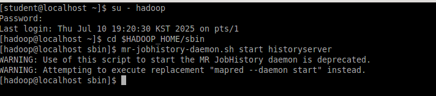
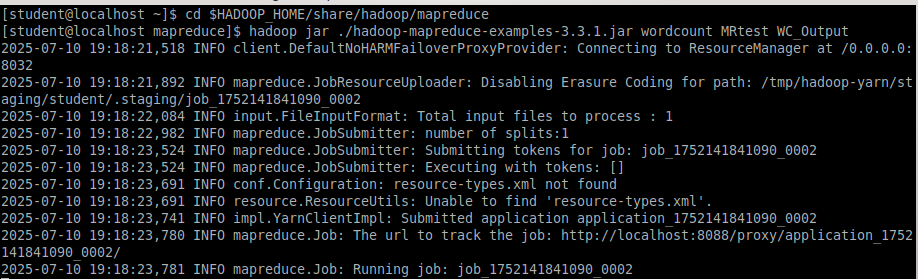
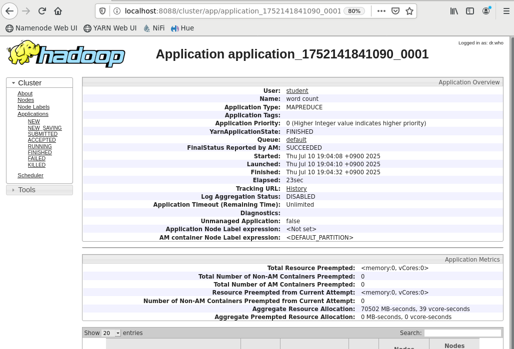
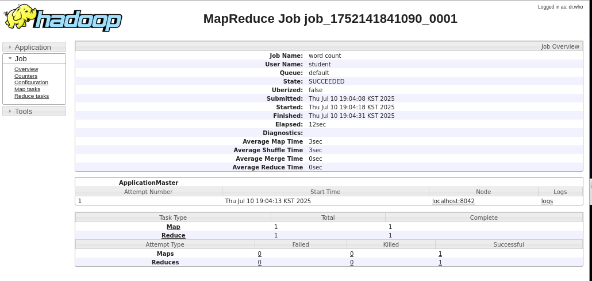
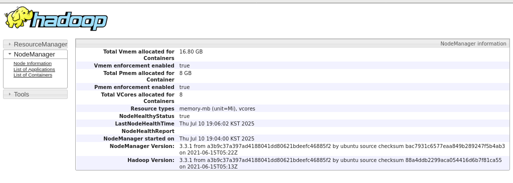
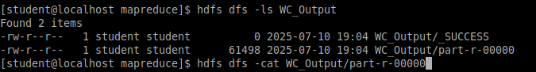
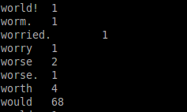

# Lab 3.1: Working with YARN and MapReduce

## Objective

The goal of Lab 3 is to understand how YARN and MapReduce work in a Hadoop environment. We utilized a sample file already stored in HDFS (`alice_in_wonderland.txt`) to perform a word count using MapReduce. We also monitored job execution using the YARN Resource Manager Web UI.

---

## 1. Starting the History Server

To enable job tracking via the web interface, we needed to start the YARN history server. This was done as the `hadoop` user:

```bash
su - hadoop
cd $HADOOP_HOME/sbin
mr-jobhistory-daemon.sh start historyserver
```


<!--  -->
This warning indicates that the mr-jobhistory-daemon.sh script is deprecated in newer versions of Hadoop. The system automatically attempted to use the newer command format instead.

Successful execution confirmed the history server had been initiated. This service allows us to monitor past and running MapReduce jobs from a web browser.


---

## 2. Running the WordCount MapReduce Program

With the services running, we switched to the `student` user and navigated to the directory containing the Hadoop examples JAR:

```bash
su - student
cd $HADOOP_HOME/share/hadoop/mapreduce
```

We executed the wordcount MapReduce job using:

```bash
hadoop jar ./hadoop-mapreduce-examples-3.3.1.jar wordcount MRtest WC_Output
```

Here:

* `MRtest` is the input directory in HDFS containing `alice_in_wonderland.txt`
* `WC_Output` is the output directory where the word count results will be stored

During execution, we could see the job being processed in the terminal, including Map and Reduce progress bars.



---

## 3. Monitoring Job on YARN Web UI

While the word count job was running, we opened a web browser and navigated to:

```
http://localhost:8088
```

On this YARN Resource Manager interface, we did the following:

* Clicked on the **"Applications"** tab to see active and completed jobs.
* Located the job using its **Application ID**.
* Clicked on the Application ID to view detailed execution logs, counters, and metrics.
* Navigated to the **Application Master UI**, which provided container-level resource usage details.

These insights helped us better understand how YARN allocates and manages resources for a job.





---

## 4. Viewing Output in HDFS

After job completion, we verified the output directory and results:

```bash
hdfs dfs -ls WC_Output
hdfs dfs -cat WC_Output/part-r-00000
```


This showed us the word frequency results generated by the MapReduce job, with each line representing a word and its count.



To rerun the job or perform new ones using the same output directory name, we needed to delete the existing output directory first:

```bash
hdfs dfs -rm -r WC_Output
```

This command recursively deleted the `WC_Output` directory in HDFS.

<!-- Example:

```
Alice	12
Rabbit	7
Queen	9
``` -->

To rerun the job or perform new ones using the same output directory name, we needed to delete the existing output directory first:

```bash
hdfs dfs -rm -r WC_Output
```

This command recursively deleted the `WC_Output` directory in HDFS.

<!--  -->

---

## Summary

In Lab 3, we:

* Started the MapReduce job history server
* Executed a word count MapReduce program on a text file in HDFS
* Monitored the job in real-time using the YARN Web UI
* Viewed and analyzed the word count results in HDFS

This lab demonstrated the flow of a typical Hadoop MapReduce job from initiation to completion, emphasizing the roles of YARN, Resource Manager, and the MapReduce programming model.

---


