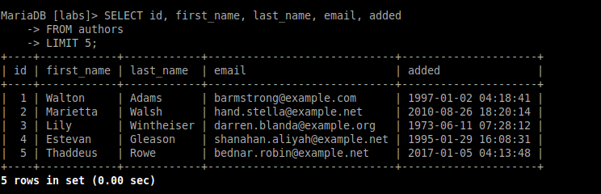
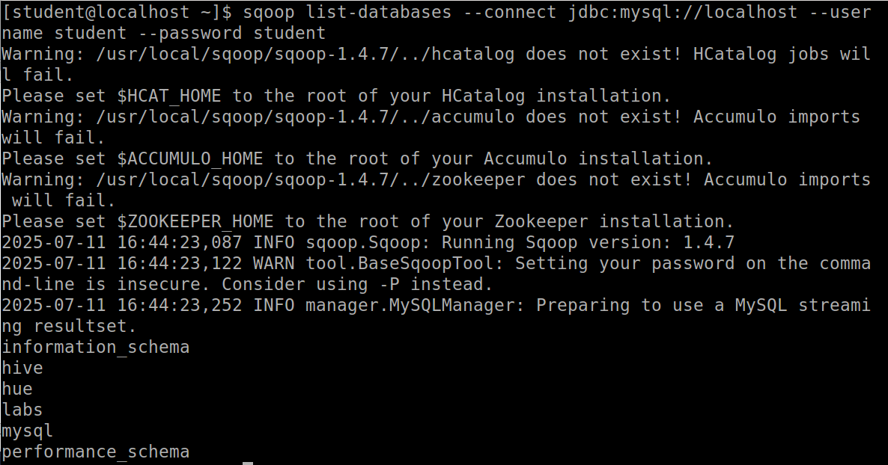
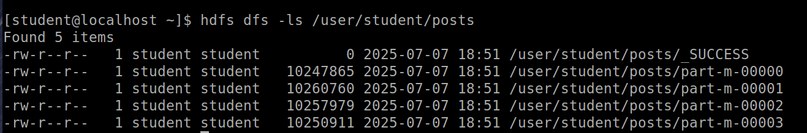

# Lab 3.2: Data Ingestion with Sqoop for RDBMS (MariaDB)

## Objective

The goal of this lab is to understand how to ingest data from relational databases into Hadoop Distributed File System (HDFS) using **Sqoop**. We performed various Sqoop operations such as importing entire tables, selective columns, filtering rows, using different file formats, and exporting data back to RDBMS.

---

## 1. Exploring the Database (MariaDB)

We began by accessing the **MariaDB** database and inspecting its structure:

```bash
mysql --user=student --password=student labs
```

We checked the existing databases and tables using:

```sql
show databases;
show tables;
describe authors;
describe posts;
```


This showed us the tables `authors` and `posts`, which we are going to use for Sqoop operations.

To understand the structure and data inside the tables, we ran the following SQL query to view some sample records from the `authors` table:

```sql
SELECT id, first_name, last_name, email, added
FROM authors
LIMIT 5;
```


This command displayed the first five rows of the `authors` table, including useful fields like the author's ID, name, email, and the date they were added. This step helps verify that the data exists and is in the expected format before performing any Sqoop imports.

After completing the exploration, we exited the MariaDB shell by typing:

```sql
quit
```

---

## 2. Sqoop Basic Commands

We checked the basic Sqoop commands and help menu:

```bash
sqoop help
sqoop help import
```

We also listed the databases and tables in MariaDB using:

```bash
sqoop list-databases --connect jdbc:mysql://localhost --username student --password student
or
sqoop list-tables --connect jdbc:mysql://localhost/labs --username student -P
```


Instead of typing the database password directly in the command using the --password option, we can use the -P (uppercase) flag. This way, Sqoop will securely prompt us to enter the password at runtime, and it won’t be visible on the screen or saved in our command history.

---

## 3. Importing Tables into HDFS

Sqoop provides an import-all-tables command that allows you to import all tables from a database into HDFS in one step. We used the following command to import all tables from the labs database:

```bash
sqoop import-all-tables --connect jdbc:mysql://localhost/labs \
--username student --password student
```

This command automatically imports every table from the specified database and saves each table's data into a separate directory under the user's home directory in HDFS.

In real environments, the import-all-tables command is rarely used because databases usually have many tables, and importing all of them at once can be time-consuming and resource-intensive. Instead, we typically import tables one by one using the import command for better control and efficiency.


We imported the entire `posts` table into HDFS:

```bash
sqoop import --connect jdbc:mysql://localhost/labs \
--username student --password student --table posts
```

To check:

```bash
hdfs dfs -ls /user/student/posts
```


---

## 4. Importing Tables to Custom Directory with Delimiter

We created a custom HDFS directory:

```bash
hdfs dfs -mkdir /mywarehouse
```

And imported the `authors` table with comma-separated fields:

```bash
sqoop import --connect jdbc:mysql://localhost/labs \
--username student --password student \
--table authors --fields-terminated-by ',' \
--target-dir /mywarehouse/authors
```

To verify:

```bash
hdfs dfs -ls /mywarehouse/authors
hdfs dfs -cat /mywarehouse/authors/part-m-00000
```


When we executed the cat command to view the contents of the imported authors table, we observed that each line of data was separated by commas (,) as specified by the --fields-terminated-by ',' option. This is different from the earlier posts file, which used the default tab (\t) delimiter in HDFS.

---

## 5. Importing Selected Columns

We imported specific columns from the `authors` table:

```bash
sqoop import --connect jdbc:mysql://localhost/labs \
--username student --password student \
--table authors --fields-terminated-by '\t' \
--columns "first_name, last_name, email"
```

---

## 6. Importing with Filters

We imported rows from `authors` where `first_name = 'Dorthy'`:

```bash
sqoop import --connect jdbc:mysql://localhost/labs \
--username student --password student \
--table authors --fields-terminated-by '\t' \
--where "first_name='Dorthy'" \
--target-dir authors_Dorthy
```


---

## 7. Importing in Parquet Format

We imported the `authors` table as Parquet:

```bash
sqoop import --connect jdbc:mysql://localhost/labs \
--username student --password student \
--table authors --target-dir /mywarehouse/authors_parquet \
--as-parquetfile
```

We retrieved the Parquet file locally and viewed it using `parquet-tools`:

```bash
hdfs dfs -get /mywarehouse/authors_parquet/<file>.parquet
parquet-tools show <file>.parquet
```


---

## 8. Importing with Compression

We imported data with compression enabled:

```bash
sqoop import --connect jdbc:mysql://localhost/labs \
--username student --password student \
--table authors --target-dir /mywarehouse/authors_compressed --compress
```


---

## 9. Exporting Data from HDFS to RDBMS

We exported the previously filtered data (`Dorthy`) back to MariaDB:

```bash
sqoop export --connect jdbc:mysql://localhost/labs \
--username student --password student \
--table authors_export --fields-terminated-by '\t' \
--export-dir dorthy
```


---

## 10. Advanced Exercises

We also worked with Sqoop to perform advanced data import operations into HDFS using both text and Parquet formats with compression.

Task 1:

To find the column names of the posts table without accessing MariaDB directly, we used the sqoop eval command. This allowed us to execute a SQL query from the terminal using Sqoop. We ran the following command to describe the structure of the posts table and retrieve its column names:

```bash
sqoop eval --connect jdbc:mysql://localhost/labs \
--username student --password student --query "DESCRIBE posts;"

```


By running this command, we were able to view the list of columns (id, author_id, title, description, content, date) along with their data types and other information, which helped us select the appropriate columns for the subsequent data import task.

Then we imported selected columns from the `posts` table into the HDFS directory `/tmp/mylabs/posts_info`. We chose only the `id`, `title`, and `date` columns and saved the data in text format with tab delimiters. This was done using the following command:

```bash
sqoop import --connect jdbc:mysql://localhost/labs \
--username student --password student \
--table posts --fields-terminated-by '\t' \
--columns "id, title, date" \
--target-dir /tmp/mylabs/posts_info
```

For viewing:
```bash
hdfs dfs -ls /tmp/mylabs/posts_info
hdfs dfs -cat /tmp/mylabs/posts_info/part-m-00000
```


Task 2:

Next, we imported the same selected data into Parquet format with Snappy compression for efficient storage. We saved this data into the `/tmp/mylabs/posts_compressed` directory using the command:

```bash
sqoop import --connect jdbc:mysql://localhost/labs \
--username student --password student \
--table posts --columns "id, title, created_at" \
--target-dir /tmp/mylabs/posts_compressed \
--as-parquetfile --compression-codec snappy
```

For viewing:
```bash
hdfs dfs -get /tmp/mylabs/posts_compressed/<filename>
parquet-tools show <filename>
```


Task 4:

For this task, we imported specific columns (id, first_name, last_name, and birthdate) from the authors table into the HDFS home directory. Before starting the import, we checked for the existence of the authors directory in HDFS. Since the directory existed, we deleted it to avoid any conflicts or overwrite issues using the command:

```bash
hdfs dfs -rm -r authors
```

After clearing the directory, we executed the Sqoop import command to bring in only the specified columns. The data was saved in plain text format with tab delimiters as required:

```bash
sqoop import --connect jdbc:mysql://localhost/labs \
--username student --password student \
--table authors --fields-terminated-by '\t' \
--columns "id, first_name, last_name, birthdate"
```


Task 5:

Finally, we imported rows from the `posts` table where the `title` column is not null. We selected only the `id`, `title`, and `content` columns and saved the data in Parquet format with Snappy compression into the `/tmp/mylabs/posts_NotN` directory. The command used was:

```bash
sqoop import --connect jdbc:mysql://localhost/labs \
--username student --password student \
--table posts --where "title is not null" \
--columns "id, title, content" \
--target-dir /tmp/mylabs/posts_NotN \
--as-parquetfile --compression-codec snappy
```


Through these exercises, we gained hands-on experience in selectively importing data, working with different file formats, applying compression, and using conditional queries within Sqoop.

---

## Summary

In this lab, we:

* Explored MariaDB databases and tables
* Performed Sqoop imports with various configurations:

  * Full table import
  * Selected columns import
  * Conditional imports using `--where`
  * Text and Parquet file formats
  * Compression using Snappy
* Exported HDFS data back to RDBMS

This lab provided practical exposure to **data ingestion pipelines using Sqoop**, a key component of Big Data ecosystems.
